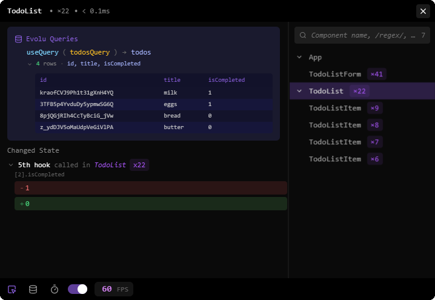
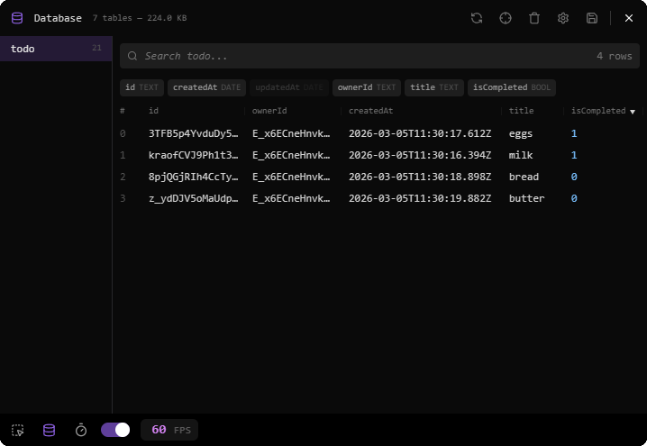

# Evolu Scan

A developer tool for [Evolu](https://evolu.dev) apps. Includes component and query inspector, database viewer, and profiling tools.

<p>
  
  
</p>

## Installation

```bash
npm i @evolu/scan
```

## Usage

```tsx
import {createEvolu} from '@evolu/common'
import {scan} from '@evolu/scan'

const evolu = createEvolu(...)

scan({
  evolu,
  enabled: __DEV__,
})
```

## Acknowledgments

This project is based on [React Scan](https://react-scan.com) by [Aiden Bai](https://github.com/sponsors/aidenybai). It is an excellent tool for profiling React apps and provided a perfect foundation to extend with specific features for Evolu.